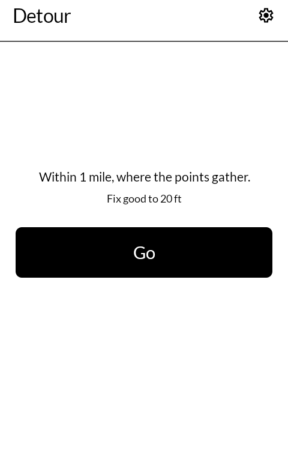
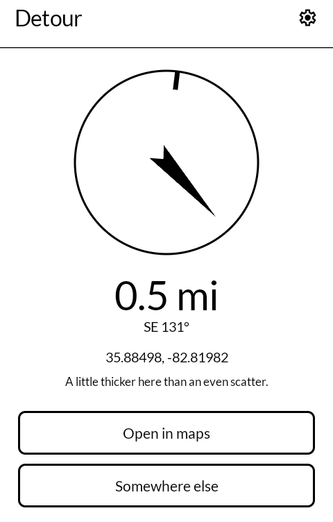
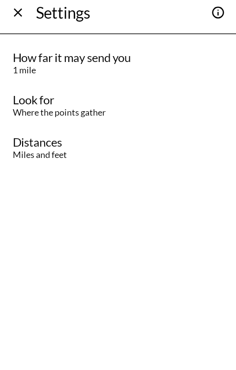
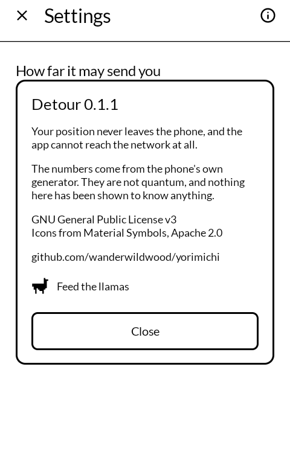

# 寄り道 yorimichi — Detour

Press once and get somewhere to walk to, picked out of a scatter of random points around
where you are standing. Built for the [Mudita Kompakt](https://mudita.com/products/kompakt/)
and its E Ink screen.

*Yorimichi* is 寄り道 — the stop you make on the way, the turning you take that was not on
the route. Which is the whole of it: a place nothing in your day would otherwise have taken
you to.

Not a fork. Written from scratch in Kotlin and Jetpack Compose, using Mudita's own
[MMD](https://github.com/mudita/MMD) design system so it looks like the apps the phone
already ships with.

| | |
|---|---|
|  |  |
|  |  |

## Where this is up to

Version 0.1.0, and honest about it: the maths is unit tested, every screen has been driven on
an emulator, and the signed release has been installed and exercised — but **nobody has
actually walked it yet.** Not once. It has never been outdoors.

So the things still unknown are the ones only a walk can answer. How long the GPS takes to fix
under trees. Whether an arrow that updates in five-degree steps is steady enough to follow on
an E Ink panel, or whether it judders. Whether the line about how thick the scatter was reads
as useful or as noise when you are standing in a field wondering why you came.

It is public at this stage precisely because of that. If you take it out, what happened is the
most useful thing you could send back.

## What it does

- Scatters a thousand points evenly over the disc around you, estimates how thickly they
  fell across it, and sends you to the thickest patch — or the thinnest, if you would rather
  have the empty part.
- Draws an arrow, a distance and the coordinate, and nothing else. **There is no map in this
  app and there will not be one.** A greyscale basemap that pans and zooms is the worst thing
  this panel can be asked to draw, and the phone already has an offline map that does it
  properly. The coordinate is handed to that one with a `geo:` intent.
- Says how thick the patch actually was, against what an even scatter would have given. Most
  runs come back somewhere ordinary, and it says so rather than dressing the answer up.
- Says how good the fix under it is, and how old, because a walk scattered around where the
  phone was twenty minutes ago is a different walk.
- Walks of ¼ mile to 5 miles, or 500 m to 10 km. Two words of settings otherwise.

## A hundred years of this

The idea is not new and it did not come from an app. On 14 April 1921 the Paris Dadaists
held the first of what they called *excursions et visites* — a guided tour of the church
of Saint-Julien-le-Pauvre, chosen for being nothing in particular. Their flyer says the
point of it plainly, in Andrew Green's translation:

> the Dadaists, wishing to correct the ineptitude of unreliable guides and cicerones,
> have decided to undertake a series of visits to selected places, especially those that
> don't really have a reason to exist.

Their tour guide read entries chosen at random from the Larousse. Three years later
Breton, Aragon, Morise and Vitrac took a train to Blois — **a town picked at random off a
map** — and walked out into the countryside for several days, which is this app with a
pin instead of a generator. The Situationists turned the same impulse into a procedure
and called it the dérive; La Monte Young wrote the whole of *Composition 1960 #10* as
"Draw a straight line and follow it", and Stanley Brouwn's entire 1962 piece reads "a
walk from a to b".

So this is a score generator, not an instrument. It writes you a one-line instruction of
that same shape — *go to 35.88498, −82.81982* — and the walk is the work.

Which is also why it does not dress up the answer. The 1921 excursion was a washout:
rain, fifty-odd people, the promised band never arrived, the auction was cancelled and
the onlookers drifted off. Everyone involved thought it a failure and it is now
considered the first work of walking art. A hundred years of this practice already know
the outing is usually a let-down, and say so. An app that promised you otherwise would be
the only one in the line that did.

The numbers here come from the phone's own generator. They are not quantum, nothing is
fetched from a server, and no claim is made that an intention held while pressing the
button reaches the arithmetic — that last part being the one thing this app declines to
inherit from Randonautica, which is otherwise its direct ancestor.

Declining it costs nothing, because the tradition already has a better account of the
same experience. Breton called it *hasard objectif*: the coincidence that arrives looking
preordained, "the true precipitate of desire". That is a claim about the person who finds
the meaning, not about the machine that picked the number — and it survives knowing
exactly how the number was picked, which the other claim does not.

## Permissions

One: `ACCESS_FINE_LOCATION`, to know where to scatter the points around. There is no
`INTERNET` permission, so nothing can leave the phone even by accident, and nothing about
where you are or where you were sent is written down. The details, and how to check them
rather than take them on trust, are in [PRIVACY.md](PRIVACY.md).

## Ancestors in code

Three earlier projects implement the same idea, and this one owes them the method:

- [OpenRando](https://github.com/realjck/OpenRando) (MIT) — the clearest short statement of
  the algorithm.
- [pyrandonaut](https://github.com/openrandonaut/pyrandonaut) (GPL-3.0-or-later) — the same
  in Python, against scipy's own kernel density estimate.
- [LibreRandonaut](https://github.com/librerandonaut/librerandonaut) (GPL-3.0-only) — the
  Android one, and where the idea of testing an attractor rather than just reporting it
  comes from.

None of their code is in here. Three things are done differently: the scatter and the
density estimate happen in metres rather than degrees, because a kernel that is round in
degrees is an ellipse on the ground; the Gaussian kernel is separated per axis, which is one
exponential per cell per axis instead of one per pair; and the answer carries a measure of
how concentrated it really was.

## Contributing

Issues and pull requests are welcome. The things that would help most, roughly in order:

- **Reports from actual walks** — where, how far, whether the arrow was followable, whether
  the fix was any good under cover.
- **Other devices.** This is built for one phone's screen, 4.3" and monochrome. It should run
  on any Android 12 or later, but it has never been seen on anything else.
- **The honest-number problem.** `concentration` compares the local density to the disc's
  average using the tenth nearest neighbour. That is a defensible choice rather than the only
  one, and if you know a better statistic for "is this cluster actually anything", say so.

Two things this app will not take, so nobody wastes an afternoon on them: a map drawn inside
the app, and any claim that intention influences the numbers. The README says why for both.

## Support

This is free software and it stays free; there is nothing here to buy. If you would like to
send something somewhere anyway, there are some llamas who go through a great deal of hay:
<https://hotspringsllamas.org/donate/>

## Licence

GNU General Public License v3.0 only. Copyright wander wildwood.

Icons are from [Material Symbols](https://fonts.google.com/icons), Apache 2.0.
